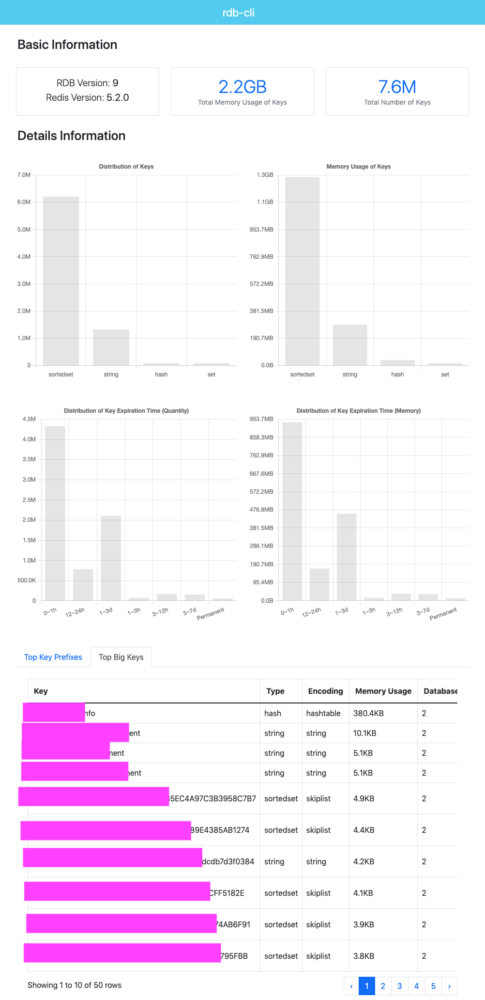

# rdb-tools

`rdb-tools` is a tool to parse/analysis redis rdb files that is implemented by csharp.

This repository is inspired by [redis-rdb-tools](https://github.com/sripathikrishnan/redis-rdb-tools) and [rdr](https://github.com/xueqiu/rdr).

## Description

This repository consists of two parts:

- A parser library, that you can customize by yourself.
- An anslysis cli tool, that your can ans some basic usages for command line.

## Usage of `rdb-cli`

Show help information:

```
[~] ./rdb-cli -h      
Description:
  rdb-cli is a command line tool, analysis redis rdb files.

Usage:
  rdb-cli [command] [options]

Options:
  -?, -h, --help  Show help and usage information
  -v, --version   Show version information

Commands:
  keys <file>    Get all keys from rdb files
  memory <file>  Get memory info from rdb files
```

The usage of `memory` is as follow:

```
[~] ./rdb-cli memory -h
Description:
  Get memory info from rdb files

Usage:
  rdb-cli memory <file> [options]

Arguments:
  <file>  The path of rdb file.

Options:
  -o, --output <output>               The output path of parsing result.
  -ot, --output-type <html|json>      The output type of parsing result. [default: json]
  -tp, --top-prefixes <top-prefixes>  The number of top key prefixes. [default: 50]
  -tb, --top-bigkeys <top-bigkeys>    The number of top big keys. [default: 50]
  -?, -h, --help                      Show help and usage information
```

```
[~] ./rdb-cli memory /tmp/demo.rdb -ot html -tb 200

Prepare to parse [/tmp/demo.rdb]
Please wait for a moment...

parse cost: 22449ms
total cost: 23107ms
result path: /tmp/res.html
```

Sample html result is as follow:



Sample json result is as follow:

```json
{
    "usedMem": 2373094496,
    "cTime": 0,
    "count": 7615333,
    "rdbVer": 9,
    "redisVer": "5.2.0",
    "redisBits": 0,
    "typeRecords": [
        {
            "Type": "sortedset",
            "Bytes": 1385664695,
            "Num": 6212084
        }
    ],
    "largestRecords": [
        {
            "Database": 2,
            "Key": "key",
            "Bytes": 10340,
            "Type": "string",
            "Encoding": "string",
            "Expiry": 0,
            "NumOfElem": 8318,
            "LenOfLargestElem": 0,
            "FieldOfLargestElem": null
        }
    ],
    "expiryInfo": [
        {
            "Expiry": "0~1h",
            "Bytes": 986801692,
            "Num": 4345021
        }
    ]
}
````
